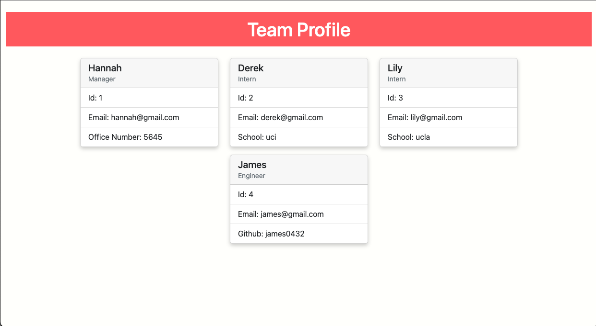

  # Team Profile Generator

  

  ## Table of content: 
  - [Description](#description)
  - [Visual](#visual)
  - [Installation](#installation)
  - [Usage](#usage)
  - [Contribution](#contribution)
  - [Tests](#tests)
  - [License](#license)
  - [Questions](#questions)

  ## Description 
  A Node.js command line application that takes in information about employees on a software engineering team, then generate an HTML webpage that displays summaries for each employee.

  See <a href="https://youtu.be/B4d14u1fISE">walkthrough</a> here.

  ## Visual 
 

  ## Installation 
  Clone the repository to your system, then install npm into your command line. Make sure you have node installed.

  ## Usage 
  Once you installed npm into your command line, run node index.js and answer the following questions to generate a profile card for each employee.
  ## Contribution 
  Feel free to contribute by making a pull request.
  ## Tests 
  Run node index.js in the command line to test the application.
  ## License 
  licensed under the [MIT](https://opensource.org/licenses/MIT) license
  ## Questions 
  Email: hanhannah839@gmail.com
  Github: hannahsykim
  